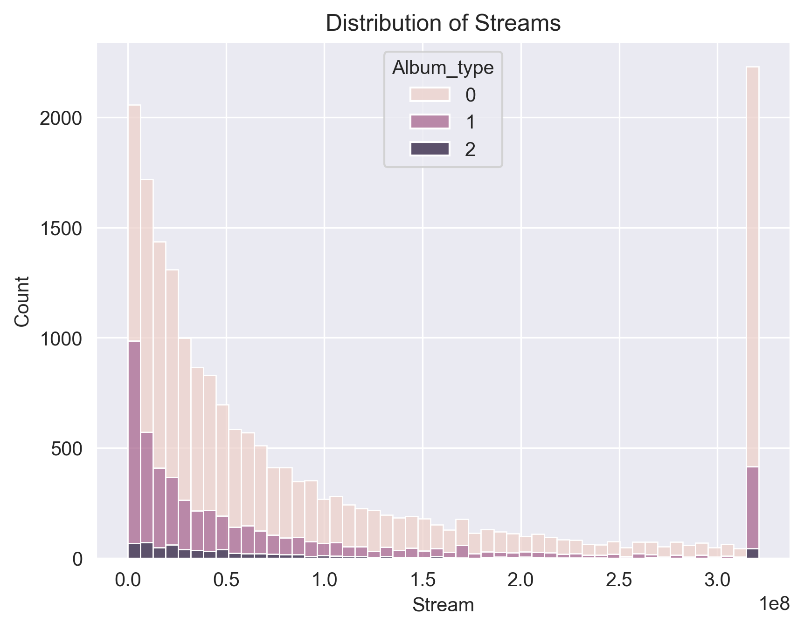
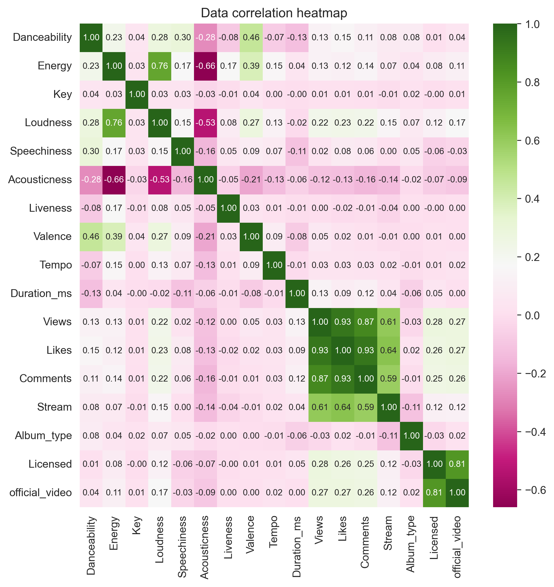
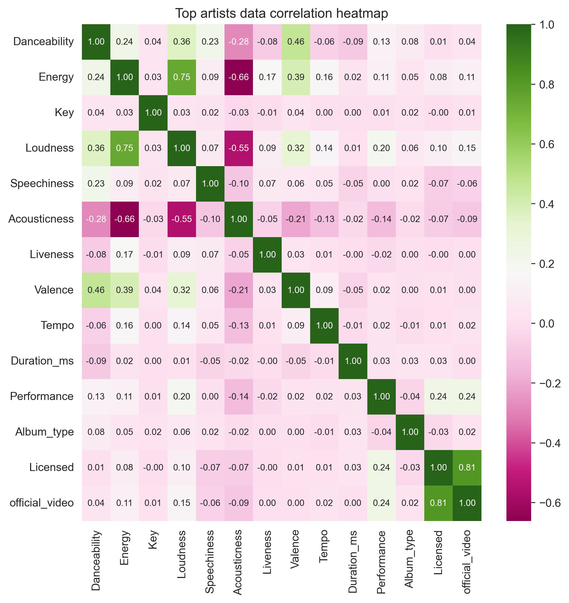
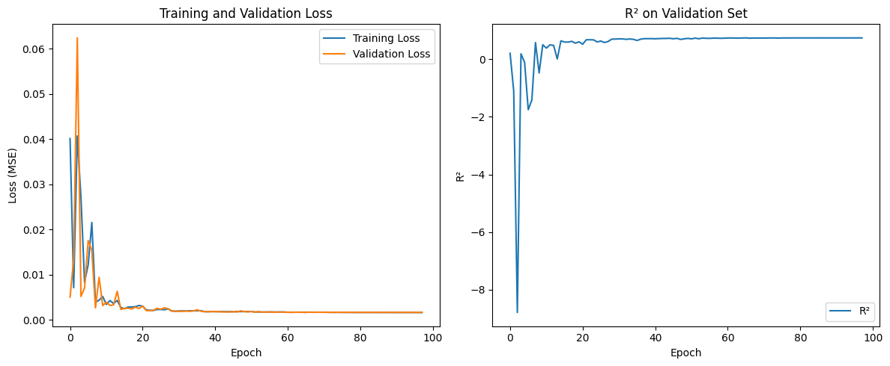

# *Please view 'Summary — Ignacy Smoliński' for a better reading experience*

# Summary: Spotify and YouTube song metrics research
## Author: Ignacy Smoliński
#### Part 1: Song metrics and their influence on song performance
#### Part 2: Spotify and YouTube song metrics predictions

-------
## Part 1 out of 2: Song metrics and their influence on song performance

## Dataset introduction

#### Metrics summary

Dataset consists of both categorical and numerical metrics, with this research focusing on the following:
- Numeric:
  - 'Danceability',
  - 'Energy',
  - 'Key',
  - 'Loudness',
  - 'Speechiness',
  - 'Acousticness',
  - 'Instrumentalness',
  - 'Liveness',
  - 'Valence',
  - 'Tempo',
  - 'Duration_ms',
  - 'Views',
  - 'Likes',
  - 'Comments',
  - 'Stream'

- Categorical: 
  - 'Album_type',
  - 'Licensed',
  - 'official_video'

The following columns have been removed from the dataset due to the limited information they provide: 
- 'Description',
- 'Url_youtube',
- 'Url_spotify',
- 'Uri',
- 'Title',
- 'Channel',
- 'Album',
- 'Track'

The following metrics have been normalised to 0...1 ranges to avoid negative values: 
- 'Loudness'

The following categorical metrics have been encoded:
 - 'Album_type':
   - Album → 0 (most common value)
   - Single → 1 (the second most common value)
   - Compilation → 2 (rarely seen value)

All rows with missing values have been dropped (less than 2.5% of the dataset in total) 

#### Removing outliers

Due to extremely large differences in values for numeric columns such as 'Stream', 'Views' or 'Likes', with some differences reaching even six magnitudes (detailed data in numeric_summary.csv file)
as we compare both global hits and niche songs by fledgling singers, it is crucial to eliminate the outliers before proceeding further.
Sample boxplot without having removed the outliers below:

As such, using the IQR method with 1.5 scale to clip outliers for numeric columns and to drop those with more than 20% outliers (too unreliable data).
Columns dropped:
- 'Instrumentalness' → 21.34% of the dataset

Despite having clipped the biggest outliers, they still overall retain a strong influence over the dataset. For that very reason, one correlation heatmap will be done by comparing the best performing singers only.

-------

## Statistics from the clipped dataset

Researching the clipped dataset allows us to see how various metrics influence the songs' performance as a whole. The most interesting of observations described in detail below.

#### Album type as the deciding factor for most listened to songs

More listened to artists tend to publish their songs in sets as albums. According to the researched on data, such an approach tends to increase the average number of streams (times a song was listened to on Spotify).

Presented as a violin plot:

When looking at the distribution (width) of the violin plot, songs released as a single appear to be far less dominant at the top — higher stream count. The histograms below provide additional information into the distribution.

Presented as a histogram with hue added:
  - default

        

    The first histogram of stream count with album type hue added to it shows the difference more clearly, especially in the last, highest bucket.
    However, as more songs are released as a part of an album, comparing the counts directly may not be the best idea. As such, an independently normalised histogram below might provide more reliable insight.

  - independently normalized for density

      

    Judging from it, it can be seen that singles are more common in the lower rangers and albums in higher ranges which would prove the conjecture.

#### The popularity of a song key

Key mappings:
- **0** = C
- **1** = C♯/D♭
- **2** = D
- **3** = D♯/E♭
- **4** = E
- **5** = F
- **6** = F♯/G♭
- **7** = G
- **8** = G♯/A♭
- **9** = A
- **10** = A♯/B♭
- **11** = B

Based on the histogram above, it can be seen that the least popular song key is the **D♯/E♭** key and the most popular are **C**, **G** and **C♯/D♭**, with **C** 
being the most frequently chosen one by a small margin.

It is also worth nothing that the independently normalised distribution with the album type hue shows that all keys have roughly equal popularity across different album types for each key. 

#### Data correlation summary for the clipped dataset

To find which metrics are correlated, the best course of action is to prepare a correlation heatmap and focus on the metrics which have values on intersection point nearing one or minus one.

Correlation heatmap:

At first glance, five correlation groups can be identified:

- POSITIVE: Loudness and Energy
  Louder songs score higher in terms of song energy rating. This correlation will be looked into with more detail later on.
- POSITIVE: Licensing of the song and presence of an official video
  Vast majority of licensed songs have an official video uploaded to YouTube platform.
- POSITIVE: Count of views on YouTube and count of comments on YouTube and count of likes on YouTube
  With very strong positive correlation between the three metrics, it is a sign that they might be replaceable by fewer new metrics. Especially since they are all connected to songs performance on YouTube platform. This will also be investigated in more detail in the further parts of this summary.
- NEGATIVE: Acousticness and Energy
    Songs perceived to be more acoustic score lower in terms of song energy rating.
- NEGATIVE: Acousticness and Loudness
  Louder songs are less acoustic.

#### Detailed Loudness and Energy correlation visualisation

To visualise and check if the correlation between the two metrics is, in fact, linear, two linear regression methods will be used.
- OLS regression — for standard visualisation and prediction of lower and upper bounds
- RLM (Robust Linear Model) — more computationally intensive, but also included to show results with outliers down-weighted during regression

Both methods show comparable results that overlap with the densest area in terms of individual points on the plot. 
The vast majority of the points also lie within the OLS lower and upper bounds, which is a clear sign that the correlation between Loudness and Energy is linear.

#### Replacing YouTube views, comments and likes with a new metric

Assumption based on correlation heatmap: YouTube views, comments and likes share a strong linear collinearity and can be replaced

Chosen method for reducing the dimensions of correlated linear variables and creating a new metric is Principal Component Analysis (PCA).
The First step is to choose the number of principal components. It will be determined based on eigenanalysis with two criteria:
- keeping only variables with eigenvalues above 1.0
- choosing the smallest number of variables while keeping the variance above 90%

Detailed results of the eigenanalysis can be found in "eigenanalysis.csv" file.
From the analysis, it can be seen that we need just the first principal component to satisfy the requirements. The new metric will be named "YT_performance" (songs performance on YouTube platform)

Updated correlation heatmap after PCA reduction:

#### Detailed Spotify and YouTube performance visualisation

Using the same two OLS and RLM methods to draw a plot:

There are three main pieces of information that can be obtained from the plot:
- There are artists who primary share their works on Spotify, even to the point of ignoring YouTube altogether
- There are artists who do the complete opposite, preferring to work solely on YouTube
- In most cases, the popularity of a song is similar on both platforms, with less popular songs slightly more dominant on YouTube and the most popular songs having a larger presence on Spotify

-------

## Summary of top artists

#### Creating a new "Performance" metric
Performance metric is based on the songs' performance on Spotify (count of streams) and YouTube ("YT_performance" metric) equal to `0.7 * standarized_streams + 0.3 * standarized_YT_performance`.
The new feature takes performance on Spotify with more weight to reduce the impact of visual part of the song.

The plot below shows the summary of top 100 artists based on cumulative performance metric (with some songs having negative performance).

Additionally, it may be insightful to review correlation of metrics based on the small sample of the best performing hundred artists.

When compared to the previous heatmap from the entirety of the dataset, it can be seen that there are barely any changes in terms of correlation values.
It signifies that the relationship between variables does not vary for the top artists and their less popular counterparts.

-------

## Part 2 out of 2: Spotify and YouTube song metrics predictions

-------

## Dataset introduction

Dataset is the same as in part 1. The outliers have not been capped, instead columns such as 'Stream', 'Views', 'Likes', 'Comments' have been scaled down using a base 10 logarithm scale.

#### Reducing the skewness

Columns 'Intrumentalness', 'Loudness', 'Liveness' and 'Speechiness' have a highly skewed distribution that will affect the machine learning models.
Column describing the duration of the song has a skewness of over 24 – with approximately the top 1% amounting to all the skew.  
Absolute skewness for all columns has been reduced below 2.0. Duration has been reduced to 0.94 by clipping approximately the upper 1.1% of the data. The 'Instrumentalness' column
has been changed from numerical to a binary categorical column.

-------

## Processing pipelines

Base processing pipeline for all data is as follows:
- numeric data
    - Median imputer
    - Standard scaler
- categorical data
    - Most frequent imputer
    - Onehot encoder

Training data: 80% of total  
Test data: 20% of total

-------

## Results for 'Album_type' predictions

#### Training set results

| Model             | Accuracy | Precision (avg) | Recall (avg)    | F1-Score (avg)  |
|-------------------|----------|-----------------|-----------------|-----------------|
| LogisticReg       | 0.9402   | 0.93 (weighted) | 0.94 (weighted) | 0.93 (weighted) |
| RandomForestClass | 1.0000   | 1.00 (weighted) | 1.00 (weighted) | 1.00 (weighted) |
| SVC               | 0.9430   | 0.94 (weighted) | 0.94 (weighted) | 0.93 (weighted) |

#### Test set results

| Model             | Accuracy | Precision (avg) | Recall (avg)    | F1-Score (avg)  |
|-------------------|----------|-----------------|-----------------|-----------------|
| LogisticReg       | 0.9368   | 0.93 (weighted) | 0.94 (weighted) | 0.92 (weighted) |
| RandomForestClass | 0.9428   | 0.94 (weighted) | 0.94 (weighted) | 0.93 (weighted) |
| SVC               | 0.9393   | 0.94 (weighted) | 0.94 (weighted) | 0.92 (weighted) |

### Balancing the dataset
Since the vast majority (over 90%) of the songs are deemed as not instrumentall, we will oversample the instrumentall ones using SMOTE and reduce the number of not instrumentall ones using TomekLinks.

#### Resampled training set results

| Model             | Precision (avg) | Recall (avg)    | F1-Score (avg)  |
|-------------------|-----------------|-----------------|-----------------|
| LogisticReg       | 0.92 (weighted) | 0.81 (weighted) | 0.84 (weighted) |
| RandomForestClass | 1.00 (weighted) | 1.00 (weighted) | 1.00 (weighted) |
| SVC               | 0.94 (weighted) | 0.87 (weighted) | 0.89 (weighted) |

#### Resampled test set results

| Model             | Precision (avg)  | Recall (avg)     | F1-Score (avg)   |
|-------------------|------------------|------------------|------------------|
| LogisticReg       | 0.916 (weighted) | 0.798 (weighted) | 0.839 (weighted) |
| RandomForestClass | 0.921 (weighted) | 0.923 (weighted) | 0.922 (weighted) |
| SVC               | 0.916 (weighted) | 0.842 (weighted) | 0.869 (weighted) |

-------

## Predicting the songs 'Loudness' based on its metrics

All models are fed exactly the same data, shuffled and divided in the same way, and have the same random state parameter chosen.

### Testing and improving single model performance

Models used:
- custom_linReg → custom implementation of linear regression
- linReg → sckit-learn linear regression
- custom_gdReg → custom implementation of gradient descent regression with `tol=1e-6` and `lr=0.035` (best performing tol and lr chosen)
- custom_gdReg_batch → custom implementation of gradient descent regression with size 64 batches, `tol=1e-6` and `lr=0.005` (best performing tol and lr chosen)
- sgdReg → sckit-learn SGD regressor with `tol=1e-6` and 'invscaling' learning rate (best performing tol and lr chosen)
- rfReg → sckit-learn random forest regressor with default parameters
- gbReg → sckit-learn gradient boost regressor with default parameters

#### Training set results

| Model                | MSE      | R² Score |
|----------------------|----------|----------|
| custom_linReg        | 0.00218  | 0.6794   |
| linReg               | 0.00218  | 0.6794   |
| custom_gdReg         | 0.00605  | 0.1093   |
| custom_gdReg_batch   | 0.00221  | 0.6740   |
| sgdReg               | 0.00218  | 0.6782   |
| rfReg                | 0.00022  | 0.9678   |
| gbReg                | 0.00152  | 0.7762   |

#### Test set results

| Model                | MSE      | R² Score |
|----------------------|----------|----------|
| custom_linReg        | 0.00215  | 0.6693   |
| linReg               | 0.00215  | 0.6693   |
| custom_gdReg         | 0.00589  | 0.0952   |
| custom_gdReg_batch   | 0.00221  | 0.6611   |
| sgdReg               | 0.00215  | 0.6695   |
| rfReg                | 0.00159  | 0.7562   |
| gbReg                | 0.00172  | 0.7359   |

------

### Adding polynomial features of second degree to the data

To improve the models' performance while not increasing the computation cost by too much,
second degree polynomial features were added to the processing pipeline.

#### Training set results

| Model                | MSE      | R² Score |
|----------------------|----------|----------|
| custom_linReg        | 0.00165  | 0.7572   |
| linReg               | 0.00165  | 0.7572   |
| custom_gdReg         | 0.21071  | -30.0423 |
| custom_gdReg_batch   | 0.00425  | 0.3736   |
| sgdReg               | 0.00171  | 0.7475   |
| rfReg                | 0.00022  | 0.9677   |
| gbReg                | 0.00145  | 0.7862   |

#### Test set results

| Model                | MSE      | R² Score |
|----------------------|----------|----------|
| custom_linReg        | 0.00173  | 0.7347   |
| linReg               | 0.00173  | 0.7347   |
| custom_gdReg         | 0.22369  | -33.3543 |
| custom_gdReg_batch   | 0.00470  | 0.2782   |
| sgdReg               | 0.00179  | 0.7254   |
| rfReg                | 0.00161  | 0.7533   |
| gbReg                | 0.00170  | 0.7387   |

Custom gradient descent regression models have a significantly worse performance with the more complex data,
while scikit-learn SGD model improved its R² by about 0.05 on the testing set.  
All training from now-on will use the data with polynomial features added.

#### Taking a closer look at the custom_gdReg_batch model

While the model does not seem over-
or underfitted looking at the converging test and training losses, its predictions tend to be too extreme.

------

### Adding three-fold cross-validation K-fold training

#### Training set results

| Model                | MSE      | R² Score |
|----------------------|----------|----------|
| custom_linReg        | 0.00165  | 0.7554   |
| linReg               | 0.00165  | 0.7554   |
| custom_gdReg         | 0.16118  | -23.0424 |
| custom_gdReg_batch   | 0.00579  | 0.1424   |
| sgdReg               | 0.00175  | 0.7404   |
| rfReg                | 0.00023  | 0.9665   |
| gbReg                | 0.00144  | 0.7862   |

#### Test set results

| Model                | MSE      | R² Score |
|----------------------|----------|----------|
| custom_linReg        | 0.00172  | 0.7450   |
| linReg               | 0.00172  | 0.7450   |
| custom_gdReg         | 0.17130  | -24.2703 |
| custom_gdReg_batch   | 0.00706  | -0.0587  |
| sgdReg               | 0.00180  | 0.7326   |
| rfReg                | 0.00159  | 0.7640   |
| gbReg                | 0.00165  | 0.7540   |

The cross-validation, as expected, improves the results, at the cost of increasing the training time.
Due to suboptimal performance, the custom models gradient descent regression models (custom_gdReg and custom_gdReg_batch) will not be used further.

------

### Adding L1 and L2 regularization to the data

Models used:
- custom_L1 → custom Ridge regression
- L1Reg → scikit-learn Ridge regression
- L2Reg → scikit-learn Lasso regression
- sgdRegL1 → previous sgdReg model with `penalty='l1'`
- sgdRegL2 → previous sgdReg model with `penalty='l2'`

For all models `alpha = 1.0`. All models were trained with the previous cross-validation technique.

#### Training set results

| Model                | MSE      | R² Score |
|----------------------|----------|----------|
| custom_L1            | 0.00165  | 0.7554   |
| L1Reg                | 0.00165  | 0.7554   |
| L2Reg                | 0.00673  | 0.0000   |
| sgdRegL1             | 0.00673  | -0.0001  |
| sgdRegL2             | 0.00212  | 0.6849   |

#### Test set results

| Model                | MSE      | R² Score |
|----------------------|----------|----------|
| custom_L1            | 0.00171  | 0.7450   |
| L1Reg                | 0.00171  | 0.7450   |
| L2Reg                | 0.00674  | -0.0009  |
| sgdRegL1             | 0.00673  | -0.0005  |
| sgdRegL2             | 0.00216  | 0.6786   |

Based on model performance, Ridge regression will be used instead of custom, normal, and Lasso regression models.
The SGD model seems to perform worse with both L1 and L2 penalty when compared to no penalty all together.

------

### Hyperparameter tuning for chosen models

The parameters will be tuned for the Ridge regression model and the SGD model.
Due to too high of a computational cost,
both the Gradient Boost and Random Forest Regression models will not be tuned
and will be used with the default parameters instead.

#### Using randomized GridSearchCV for Ridge regression

Goal: tune the `alpha` parameter value

Results:  
Fitting 5 folds for each of 55 candidates, totalling 275 fits
Best parameters for Ridge: Ridge(alpha=15.741890047456648)
Best score for Ridge: -0.001706411672508681

#### Using randomized GridSearchCV for SGD model

Goal: tune the `alpha`, `penalty`, and `learning_rate` parameter value

Results:  
Fitting 5 folds for each of 55 candidates, totalling 275 fits
Best parameters for SGDRegressor:
SGDRegressor(alpha=0.00010792764548678457, learning_rate='invscaling', penalty='elasticnet')
Best score for SGDRegressor: -0.0017687449450905983

------

### Creating a stacked regressor

The following models will be used to create the stacked regressor using scikit-learn StackedRegressor model:
- best_ridge → Ridge(alpha=15.741890, random_state=42)
- best_sgd → SGDRegressor(alpha=np.float64(0.000108), learning_rate='invscaling', penalty='elasticnet', max_iter=5000, random_state=42)
- best_rf → RandomForestRegressor(random_state=42, n_jobs=-1)
- best_gb → GradientBoostingRegressor(random_state=42)

The default, RidgeCV regressor, will be used as the final estimator of the model.

#### Results

| Data set | MSE     | R² Score |
|----------|---------|----------|
| Train    | 0.00055 | 0.9187   |
| Test     | 0.00157 | 0.7582   |

------

### Training a regression model using PyTorch

Model: Liner with 22 input features and one output
Optimizer chosen: Adam, `lr=0.01`, `weight_decay=1e-5`
Scheduler chosen: `ReduceLROnPlateau` with `mode='min'`, `patience=5` and `factor=0.5`
Criterion: MSELoss  
Batch size: 64  
Max number of epochs: 300

Training data: 64% of total  
Validation data: 16% of total
Test data: 20% of total

#### Results

| Data set | MSE     | R² Score |
|----------|---------|----------|
| Train    | 0.00167 | 0.7534   |
| Test     | 0.00173 | 0.7336   |

Training was stopped early at epoch 98 due to scheduler patience value being exceeded.

#### Plot: Training and validation loss; R² on validation set during training

#### Plot: Actual vs predicted values

------

### Creating a Mixture of Experts model

Strategy chosen: Top-K experts (`k = 2`)
Gating model: Top-K gate with a Random Forest Classifier model with 10 estimators (due to a rather small gate training dataset)
Experts chosen:
- best_ridge → Ridge(alpha=15.741890, random_state=42)
- best_sgd → SGDRegressor(alpha=np.float64(0.000108), learning_rate='invscaling', penalty='elasticnet', max_iter=5000, random_state=42)
- best_rf → RandomForestRegressor(random_state=42, n_jobs=-1)
- best_gb → GradientBoostingRegressor(random_state=42)
- torch → previously mentioned Torch model modified to have a scikit-learn-like API

Data split: 65% for training experts, 20% for training the gating model and 15% for testing the MoE model

#### Results

| Data set | MSE     | R² Score |
|----------|---------|----------|
| Train    | 0.00093 | 0.8616   |
| Test     | 0.00147 | 0.7896   |

Training data is only the dataset used for training the expert models in order to avoid the leakage from the gate training data.

------

## Summary table

- '-' → no changes'
- 'p' → polynomial features added
- 'k-f' → k-fold training
- 'r' → regularization added

#### Training results

| Model mod | Model              | MSE      | R² Score |
|-----------|--------------------|----------|----------|
| -         | custom_linReg      | 0.00218  | 0.6794   |
| -         | linReg             | 0.00218  | 0.6794   |
| -         | custom_gdReg       | 0.00605  | 0.1093   |
| -         | custom_gdReg_batch | 0.00221  | 0.6740   |
| -         | sgdReg             | 0.00218  | 0.6782   |
| -         | rfReg              | 0.00022  | 0.9678   |
| -         | gbReg              | 0.00152  | 0.7762   |
| p         | custom_linReg      | 0.00165  | 0.7572   |
| p         | linReg             | 0.00165  | 0.7572   |
| p         | custom_gdReg       | 0.21071  | -30.0423 |
| p         | custom_gdReg_batch | 0.00425  | 0.3736   |
| p         | sgdReg             | 0.00171  | 0.7475   |
| p         | rfReg              | 0.00022  | 0.9677   |
| p         | gbReg              | 0.00145  | 0.7862   |
| p k-f     | custom_linReg      | 0.00165  | 0.7554   |
| p k-f     | linReg             | 0.00165  | 0.7554   |
| p k-f     | custom_gdReg       | 0.16118  | -23.0424 |
| p k-f     | custom_gdReg_batch | 0.00579  | 0.1424   |
| p k-f     | sgdReg             | 0.00175  | 0.7404   |
| p k-f     | rfReg              | 0.00023  | 0.9665   |
| p k-f     | gbReg              | 0.00144  | 0.7862   |
| p k-f r   | custom_L1          | 0.00165  | 0.7554   |
| p k-f r   | L1Reg              | 0.00165  | 0.7554   |
| p k-f r   | L2Reg              | 0.00673  | 0.0000   |
| p k-f r   | sgdRegL1           | 0.00673  | -0.0001  |
| p k-f r   | sgdRegL2           | 0.00212  | 0.6849   |
| p r       | stacked_reg        | 0.00055  | 0.9187   |
| p r       | torch              | 0.00167  | 0.7534   |
| p r       | MoE                | 0.00093  | 0.8616   |

#### Test results
| Model mod | Model              | MSE      | R² Score |
|-----------|--------------------|----------|----------|
| -         | custom_linReg      | 0.00215  | 0.6693   |
| -         | linReg             | 0.00215  | 0.6693   |
| -         | custom_gdReg       | 0.00589  | 0.0952   |
| -         | custom_gdReg_batch | 0.00221  | 0.6611   |
| -         | sgdReg             | 0.00215  | 0.6695   |
| -         | rfReg              | 0.00159  | 0.7562   |
| -         | gbReg              | 0.00172  | 0.7359   |
| p         | custom_linReg      | 0.00173  | 0.7347   |
| p         | linReg             | 0.00173  | 0.7347   |
| p         | custom_gdReg       | 0.22369  | -33.3543 |
| p         | custom_gdReg_batch | 0.00470  | 0.2782   |
| p         | sgdReg             | 0.00179  | 0.7254   |
| p         | rfReg              | 0.00161  | 0.7533   |
| p         | gbReg              | 0.00170  | 0.7387   |
| p k-f     | custom_linReg      | 0.00172  | 0.7450   |
| p k-f     | linReg             | 0.00172  | 0.7450   |
| p k-f     | custom_gdReg       | 0.17130  | -24.2703 |
| p k-f     | custom_gdReg_batch | 0.00706  | -0.0587  |
| p k-f     | sgdReg             | 0.00180  | 0.7326   |
| p k-f     | rfReg              | 0.00159  | 0.7640   |
| p k-f     | gbReg              | 0.00165  | 0.7540   |
| p k-f r   | custom_L1          | 0.00171  | 0.7450   |
| p k-f r   | L1Reg              | 0.00171  | 0.7450   |
| p k-f r   | L2Reg              | 0.00674  | -0.0009  |
| p k-f r   | sgdRegL1           | 0.00673  | -0.0005  |
| p k-f r   | sgdRegL2           | 0.00216  | 0.6786   |
| p r       | stacked_reg        | 0.00157  | 0.7582   |
| p r       | torch              | 0.00173  | 0.7336   |
| p r       | MoE                | 0.00147  | 0.7896   |
