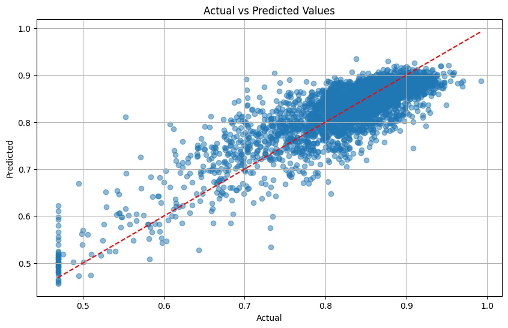

# Summary: Spotify and YouTube song metrics predictions
## Author: Ignacy Smoliński
#### Part 2 out of 3

-------

## Dataset introduction

Dataset is the same as in part 1. The outliers have not been capped, instead columns such as 'Stream', 'Views', 'Likes', 'Comments' have be scaled down using a base 10 logarithm scale.

#### Reducing the skewness

Columns 'Intrumentalness', 'Loudness', 'Liveness' and 'Speechiness' have a highly skewed distribution that will affect the machine learning models.
Column describing the duration of the song has a skewness of over 24 – with approximately the top 1% amounting to all the skew.  
Absolute skewness for all columns has been reduced below 2.0. Duration has been reduced to 0.94 by clipping approximately the upper 1.1% of the data. The 'Instrumentalness' column
has been changed from numerical to a binary categorical column.

-------

## Processing pipelines

Processing pipeline for all data is as follows:
- numeric data
  - Median imputer
  - Standard scaler
- categorical data
  - Most frequent imputer
  - Onehot encoder

Training data: 80% of total  
Test data: 20% of total

-------

## Results for 'Album_type' predictions

#### Training set results

| Model             | Accuracy | Precision (avg) | Recall (avg)    | F1-Score (avg)  |
|-------------------|----------|-----------------|-----------------|-----------------|
| LogisticReg       | 0.9402   | 0.93 (weighted) | 0.94 (weighted) | 0.93 (weighted) |
| RandomForestClass | 1.0000   | 1.00 (weighted) | 1.00 (weighted) | 1.00 (weighted) |
| SVC               | 0.9430   | 0.94 (weighted) | 0.94 (weighted) | 0.93 (weighted) |

#### Test set results

| Model             | Accuracy | Precision (avg) | Recall (avg)    | F1-Score (avg)  |
|-------------------|----------|-----------------|-----------------|-----------------|
| LogisticReg       | 0.9368   | 0.93 (weighted) | 0.94 (weighted) | 0.92 (weighted) |
| RandomForestClass | 0.9428   | 0.94 (weighted) | 0.94 (weighted) | 0.93 (weighted) |
| SVC               | 0.9393   | 0.94 (weighted) | 0.94 (weighted) | 0.92 (weighted) |

-------

## Predicting the songs 'Loudness' based on its metrics

All models are fed exactly the same data, shuffled and divided in the same way, and have the same random state parameter chosen.

### Method 1 — using custom and sckit-learn models

Models used:
- custom implementation of linear regression
- sckit-learn linear regression
- custom implementation of gradient descent regression with `tol=1e-4` and `lr=0.35` (best performing tol and lr chosen)
- custom implementation of gradient descent regression with size 64 batches, `tol=1e-4` and `lr=0.35` (best performing tol and lr chosen)
- sckit-learn SGD regressor with `tol=1e-4` and adaptive learning rate (best performing tol and lr chosen)

#### Training set results

| Model              | MSE     | R² Score |
|--------------------|---------|----------|
| custom_linReg      | 0.00218 | 0.6792   |
| linReg             | 0.00218 | 0.6792   |
| custom_gdReg       | 0.00456 | 0.3281   |
| custom_gdReg_batch | 0.00323 | 0.5247   |
| sgdReg             | 0.00218 | 0.6792   |

#### Test set results

| Model              | MSE     | R² Score |
|--------------------|---------|----------|
| custom_linReg      | 0.00215 | 0.6693   |
| linReg             | 0.00215 | 0.6693   |
| custom_gdReg       | 0.00442 | 0.3218   |
| custom_gdReg_batch | 0.00321 | 0.5069   |
| sgdReg             | 0.00215 | 0.6693   |

### Method 2 — using Tensorflow tools

Model: Liner with 22 input features and one output
Optimizer chosen: Adam, `lr=0.01`, `weight_decay=1e-5`
Scheduler chosen: `ReduceLROnPlateau` with `mode='min'`, `patience=5` and `factor=0.5`
Criterion: MSELoss
Batch size: 64

Training data: 64% of total  
Validation data: 16% of total
Test data: 20% of total

| Data set | MSE        | R² Score |
|----------|------------|----------|
| Train    | 0.00217757 | 0.679196 |
| Test     | 0.00215854 | 0.668483 |

#### Plot: Training and validation loss ; R² on validation set during training

#### Plot: Actual vs predicted values

